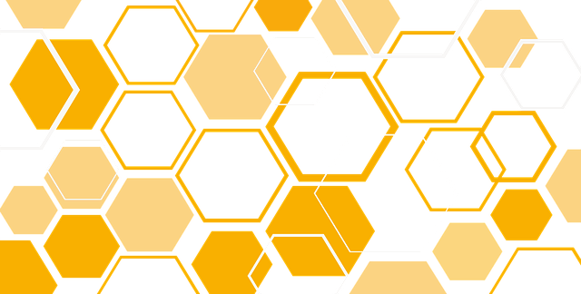

# Microservices Ottawa
Idea tracker and presentations for [Microservices Ottawa Meetup](https://www.meetup.com/DDD-CQRS-ES/events/242749759/).

## Presentations

Please clone the repo and add your presentation under the `yyyy-mm-dd-lastname-firstword` folder.

For example, for presentation by Andriy Drozdyuk entitled "Command Query Responsibility Segregation" presented on Sep 12, 2017 the title of the folder would be `2017-09-12-drozdyuk-command`.

## Ideas Suggestions and Scheduled

Please open an issue if you'd like to present or want to hear on a particular subject.

## Credits

Idea of using github as a tracker for a meetup shamelessly stolen from [Elixir Ottawa Meetup](https://github.com/ElixirOttawaMeetup).

Image from [pixabay](https://pixabay.com/en/hive-rhombus-yellow-abstract-2002878/).
